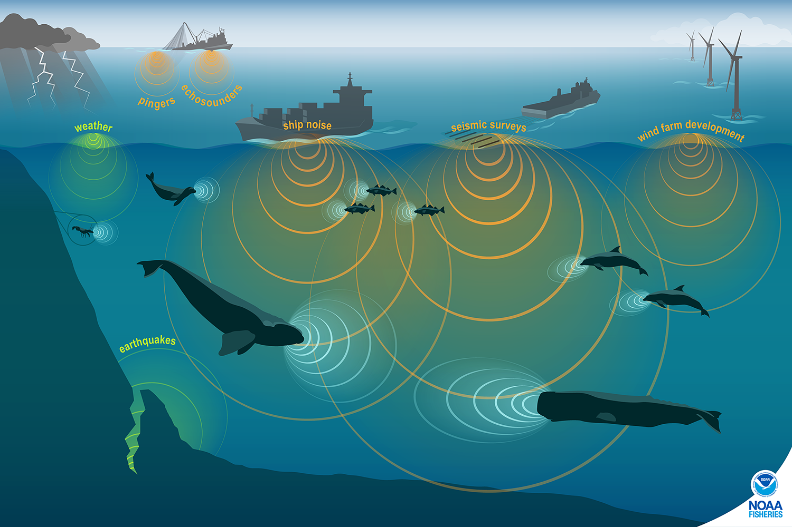

*"By listening to sensitive underwater environments with passive acoustic monitoring tools, we can learn more about migration patterns, animal behavior and communication" - National Oceanic and Atmospheric Administration (NOAA)*

Badge [source](https://shields.io/)

# Data
## Extraction
This project will use the [Watkins Marine Mammal Sound Database](https://whoicf2.whoi.edu/science/B/whalesounds/bestOf.cfm?code=CC2A), specifically the "Best Of" Cuts, which "contains 1,694 sound cuts deemed to be of higher sound quality and lower noise from 32 different [marine] species." 

## Transformation
Foreword: What would be a good baseline audio file length for machine learning classification? 
- [Here is an answer, ](https://stackoverflow.com/questions/32355803/why-do-you-need-to-segment-the-audios-5-30-seconds-each-for-building-the-acousti); When audio is long it is harder to get a good match because there are too many variants and possibilities for mistake, for that reason it is better to keep recommended utterance length.
- [Here is another answer,](https://cmusphinx.github.io/wiki/tutorialam/); For continuous speech the optimal length for audio recordings is between 5 seconds and 30 seconds. Very long recordings make training much harder.

Since many of the "Best Of" Cuts are 1 to 3 seconds, audio files of the same class (name mammal name) are concatenated into itself until they are 30 seconds.
Audio files longer than 30 seconds are split into 30 second chunks, and are saved as training data. Here’s how it behaves for different file lengths:
| File Length | Chunks Created | Notes |
|---|---|---|
| 29  | 1 chunk (29s)  | Only one partial chunk  |
| 30  | 1 chunk (30s)  | Perfect split  |
| 59s  | 1 chunk (30s), 1 chunk (29s)  | Handles remainder  |
| 60s	|2 chunks (30s, 30s)	|Perfect split
| 89s	|2 chunks (30s, 30s), 1 chunk (29s)	|Remainder is captured
| 90s	|3 chunks (30s, 30s, 30s)	|Perfect split
| 120s	|4 chunks (30s, 30s, 30s, 30s)	|No remainder

## Load

# Test Predictions
- [False Killer Whales + Bottlenose Dolphins](https://www.youtube.com/watch?v=2WY6Rf2gYKE)
- [Minke Whale boing sound](https://www.youtube.com/watch?v=fY7mVNqPA5I)
- [Humpback Whales](https://www.youtube.com/watch?v=QUIoO0u5hR8)

## Sources/Further Reads
- https://noaa.maps.arcgis.com/apps/Cascade/index.html?appid=c653c78262a7487da42149ebc86f80c2